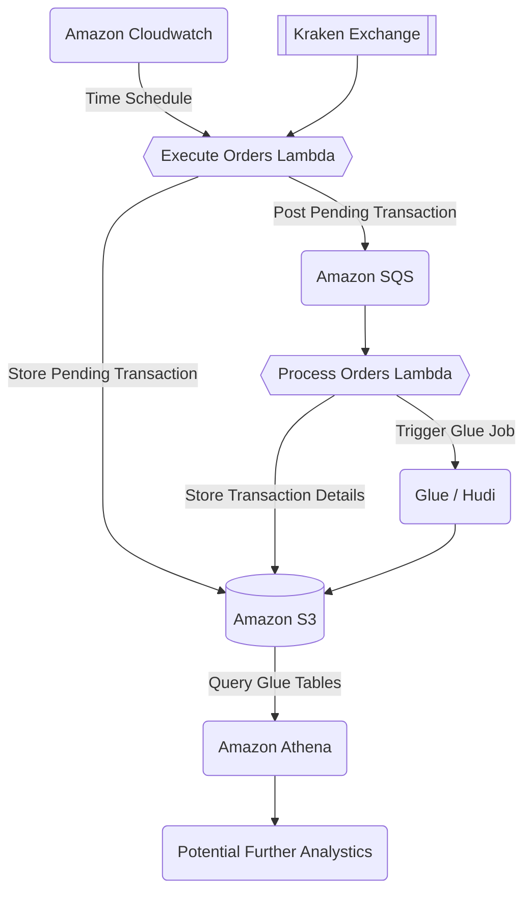

# dca-manager

> Dollar Cost Average Manager

[](https://github.com/kiran94/dca-manager/actions/workflows/main.yml) [](https://pkg.go.dev/github.com/kiran94/dca-manager) [](https://goreportcard.com/report/github.com/kiran94/dca-manager)

<!-- toc GFM -->

* [Getting Started](#getting-started)
    * [Infrastructure](#infrastructure)
    * [Hudi Integration](#hudi-integration)
    * [Code](#code)
    * [Running](#running)
* [Configuration](#configuration)
* [Schedules](#schedules)
* [Architecture](#architecture)

<!-- /toc -->

## Getting Started

### Infrastructure

Assuming you are at the root of the repository.

```sh
# Export Terraform Variables
export TF_VAR_KRAKEN_API_KEY=your_key
export TF_VAR_KRAKEN_API_SECRET=your_secret
export TF_VAR_lambda_failure_dlq_email='["you@email.com"]'
export TF_VAR_lambda_success_email='["you@email.com"]'

cd terraform

# The aws and github providers require authentication
# https://registry.terraform.io/providers/hashicorp/aws/latest/docs#authentication
# https://registry.terraform.io/providers/integrations/github/latest/docs#authentication

# The terraform backend configured will also need to be updated
# The aws region may also need to be updated

terraform init

# Apply Infrastructure
terraform plan
terraform apply

# Add remote repository to local
git remote add origin $(terraform output -raw github_repository_ssh_clone_url)
```

*Note some coordination might be required here. Where the lambda function cannot be created without the zip file existing in the S3 location first. Therefore this may need to be at least uploaded to S3 first before `terraform apply` will complete successfully. Once everything is in place then CI will handle deploying any modifications*

### Hudi Integration

This solution also loads processed transactions into an [Apache Hudi Table](https://hudi.apache.org/) which can be accessed with [Amazon Athena](https://aws.amazon.com/athena) for further analytics processing.

In order to do this, the [AWS Glue Connector for Apache Hudi](https://aws.amazon.com/marketplace/server/procurement?productId=e918d411-44a4-4b8d-b995-e101d7ef670b) must be applied to the target AWS account. Unfortunately I am not able to find a way to do this via terraform but you can follow these [instructions](https://aws.amazon.com/blogs/big-data/writing-to-apache-hudi-tables-using-aws-glue-connector/) to get setup. In this solution we use Spark 3 and therefore the default connection name we apply is `hudi-connection3`.

Once this has been completed, then the name of the setup connection should be set into the terraform variable `glue_connections`.

Once the Infrastructure has been applied/deployed then it can be run either with the following command or from the Glue UI.

```sh
aws glue start-job-run --job-name $(terraform -chdir=terraform output -json | jq --raw-output '.glue_load_transactions_job.value')
```

Natually, you will need some transactions executed in order for this to be useful.

### Code

Assuming you are at the root of the repository.


Set Required Environment Variables:

```sh
export DCA_BUCKET=$(terraform -chdir=terraform output -raw bucket)
export DCA_CONFIG=$(terraform -chdir=terraform output -raw config_path)
export DCA_PENDING_ORDERS_QUEUE_URL=$(terraform -chdir=terraform output -raw pending_orders_queue_url)
export DCA_PENDING_ORDER_S3_PREFIX=$(terraform -chdir=terraform output -raw aws_lambda_pending_order_path)
```

The `makefile` documents all the recommended commands:

```sh
make install_tools

make build
make test
make lint
```

### Running

Once the infrastructure is up you can either run the code locally or via lambda. This repository consists of multiple lambdas, you can run them locally like so:

```sh
go run cmd/execute_orders/main.go
go run cmd/process_orders/main.go
```

This will pull data from a combination of sources such as the environment and SSM. Additionally the config uploaded in S3 will be used to determine what to do.

By default, dca-manager should not execute real transactions on an exchange without the `DCA_ALLOW_REAL` being set to any value.

*Please make sure to inspect the code and make sure everything is in order before attaching a real account and running this in production to avoid unexpected transactions.*

## Configuration

The configuration drives the orders which are executed regularly. At a given interval of time, the configuration is pulled and the process runs through the list of orders.

For example if you wanted to setup a regular market order for 5 `ADAGBP` via kraken then the configuration might look like this:

*config.json*

```json5
{
  "orders": [
    {
      "exchange": "kraken",
      "direction": "buy",
      "ordertype": "market",
      "volume": "5",
      "pair": "ADAGBP",
      "validate": true,
      "enabled": true
    }
  ]
}
```

See [example_config.json](./pkg/configuration/example_config.json) will by default upload to the designated location in S3 via terraform.

## Schedules

Scheduling for execution of new orders can be found in the terraform variable `execute_orders_schedules`. Multiple schedules are supported.

For example, if we wanted to define a schedule for 6AM UTC on Friday and Wednesday then we could configure this:

```terraform
variable "execute_orders_schedules" {
  type = list(object({
    description         = string
    schedule_expression = string
  }))

  default = [
    {
      description         = "At 6:00 UTC on every Friday"
      schedule_expression = "cron(0 6 ? * FRI *)"
    },
    {
      description         = "At 6:00 UTC on every Wednesday"
      schedule_expression = "cron(0 6 ? * WED *)"
    }
  ]
}
```

See [AWS Schedule Expressions](https://docs.aws.amazon.com/lambda/latest/dg/services-cloudwatchevents-expressions.html) for all the supported options.

See [variables.tf](./terraform/variables.tf)

## Logging

When running within Lambda, functions are logging in JSON format to support filtering. Therfore you can filter using queries like this:

```
{ $.level = "info" }
```

See more [here](https://docs.aws.amazon.com/AmazonCloudWatch/latest/logs/FilterAndPatternSyntax.html#matching-terms-events)


## Architecture


